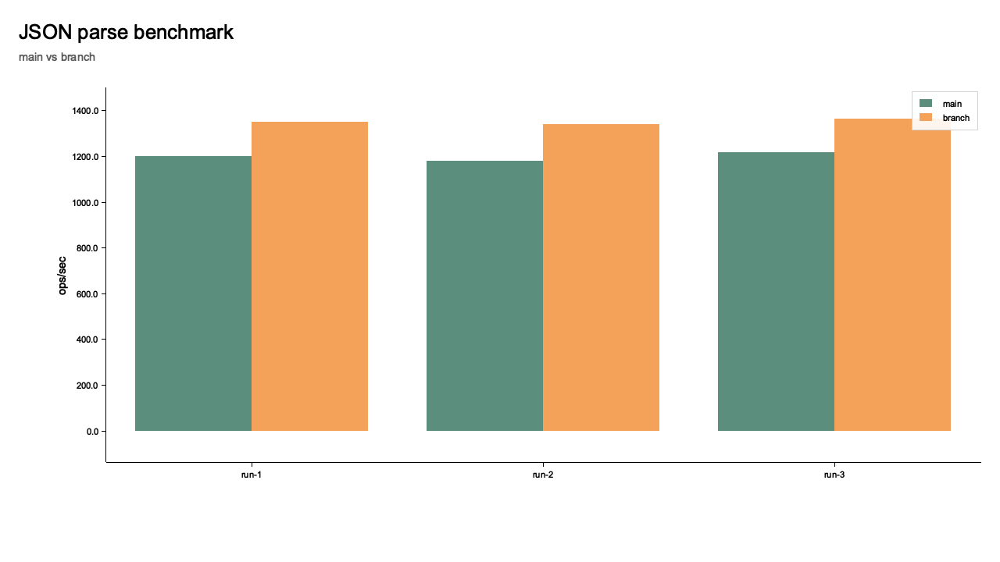
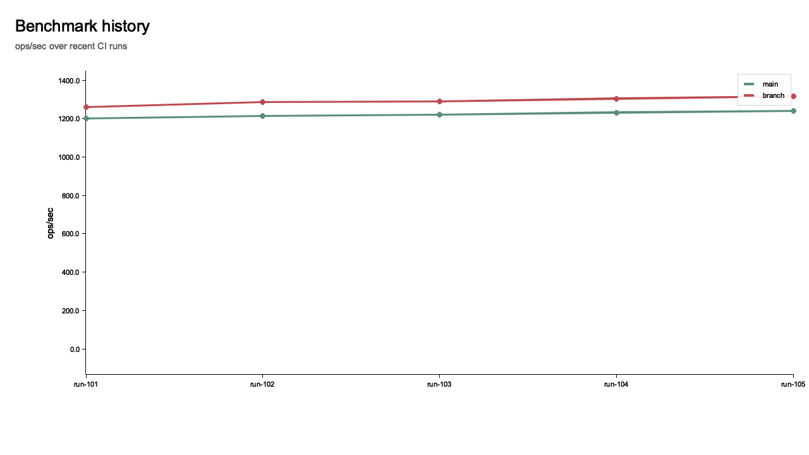
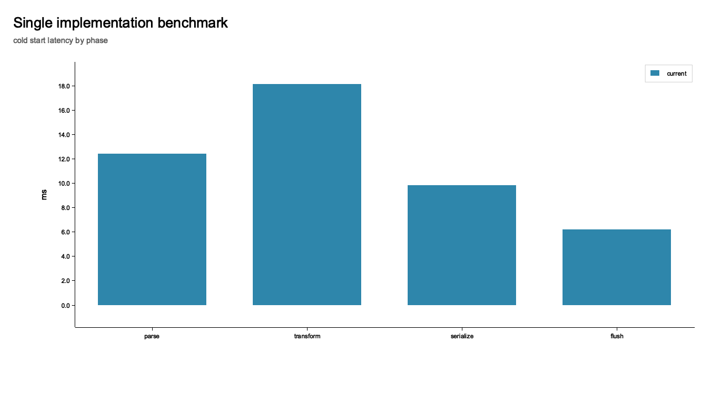
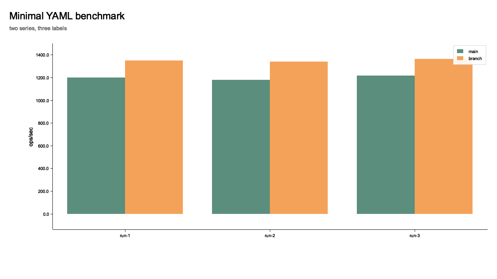
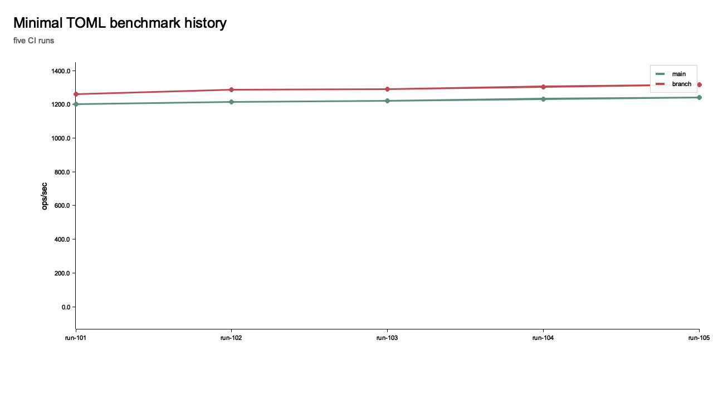

# pretty-bench

`pretty-bench` is the repository for the scoped npm package `@workspaces-team/pretty-bench`, a CLI-first tool for generating static PNG benchmark charts inside repositories.

It exists for one narrow job:

- render deterministic benchmark images from JSON, YAML, or TOML specs
- make those images easy to regenerate in CI
- keep the generated PNGs versioned alongside benchmark results

It is not an interactive charting library and it is not a browser visualization framework.

## Why It Exists

Benchmark reporting inside repos is usually awkward:

- JS charting libraries pull in large dependency trees
- headless browser rendering adds CI complexity
- generated charts often live outside the repo instead of being versioned with the data

`pretty-bench` keeps the boundary coarse and boring:

- spec file in
- PNG out
- Rust does the rendering
- the npm package is a thin zero-runtime-dependency wrapper
- the Node boundary is implemented with `napi-rs`

## Positioning

- zero JS runtime dependencies in the main package
- no JS charting dependency required
- no Rust toolchain required for end users of the published package
- built for benchmark chart generation in CI and repos
- optimized for `npx @workspaces-team/pretty-bench ...`
- uses `https://napi.rs/` for the native Node bridge while keeping the npm package dependency-free at runtime

## V1 Chart Types

- `bar`
- `grouped-bar`
- `line`

## Install

Published package usage:

```bash
npm install --save-dev @workspaces-team/pretty-bench
```

or run it directly with `npx`:

```bash
npx @workspaces-team/pretty-bench validate --input ./benchmarks/current-vs-baseline.yaml
npx @workspaces-team/pretty-bench render --input ./benchmarks/current-vs-baseline.yaml --output ./benchmarks/current-vs-baseline.png
```

or in a pnpm workspace:

```bash
pnpm add -D @workspaces-team/pretty-bench
```

Repo development usage:

```bash
npm install
npm run build:renderer:debug
```

The published package is intended to ship with a prebuilt napi-rs native addon. Local repo development uses Cargo to build the Rust addon from source.
The published package is intended to ship with a prebuilt napi-rs native addon. Local repo development uses Cargo to build the addon from source.

## CLI

Render a PNG:

```bash
npx @workspaces-team/pretty-bench render --input ./benchmarks/current-vs-baseline.yaml --output ./benchmarks/current-vs-baseline.png
```

Validate a spec:

```bash
npx @workspaces-team/pretty-bench validate --input ./benchmarks/current-vs-baseline.toml
```

Create a starter spec:

```bash
npx @workspaces-team/pretty-bench init --output ./benchmarks/new-chart.yaml --type grouped-bar
```

Installed command:

- `pretty-bench`

Recommended usage:

- one-shot: `npx @workspaces-team/pretty-bench ...`
- installed dependency: `pretty-bench ...`

Supported input formats:

- JSON
- YAML
- TOML

V1 keeps the spec intentionally small and human-editable across all three.

## Schema

```json
{
  "version": 1,
  "type": "grouped-bar",
  "title": "JSON parse benchmark",
  "subtitle": "main vs branch",
  "unit": "ops/sec",
  "labels": ["run-1", "run-2", "run-3"],
  "series": [
    { "name": "main", "values": [1200, 1180, 1215] },
    { "name": "branch", "values": [1350, 1340, 1362] }
  ]
}
```

Supported optional fields:

- `width`
- `height`
- `yAxis.min`
- `yAxis.max`
- `series[].color`

The packaged JSON Schema file lives at `schemas/pretty-bench-v1.schema.json`.

Format guidance:

- use JSON when benchmark scripts generate the spec
- use YAML when humans maintain the spec in-repo
- use TOML when the repo already prefers TOML configuration

See [docs/FORMATS.md](./docs/FORMATS.md).

## Tiny YAML Example

This is enough to generate a useful chart:

```yaml
version: 1
type: "grouped-bar"
title: "Minimal YAML benchmark"
labels:
  - "run-1"
  - "run-2"
series:
  - name: "main"
    values: [1200, 1180]
  - name: "branch"
    values: [1350, 1340]
```

Then run:

```bash
npx @workspaces-team/pretty-bench render --input ./benchmarks/minimal.yaml --output ./benchmarks/minimal.png
```

## Tiny TOML Example

```toml
version = 1
type = "line"
title = "History"
labels = ["run-1", "run-2", "run-3"]

[[series]]
name = "main"
values = [1200, 1210, 1230]
```

## Examples

Benchmark comparison:

```bash
npx @workspaces-team/pretty-bench render \
  --input ./examples/specs/current-vs-baseline.json \
  --output ./examples/output/current-vs-baseline.png
```

Historical trend:

```bash
npx @workspaces-team/pretty-bench render \
  --input ./examples/specs/history-line.json \
  --output ./examples/output/history-line.png
```

Single-series bar chart:

```bash
npx @workspaces-team/pretty-bench render \
  --input ./examples/specs/bar-single-series.json \
  --output ./examples/output/bar-single-series.png
```

Minimal YAML:

```bash
npx @workspaces-team/pretty-bench render \
  --input ./examples/specs/minimal-grouped.yaml \
  --output ./examples/output/minimal-grouped.png
```

Minimal TOML:

```bash
npx @workspaces-team/pretty-bench render \
  --input ./examples/specs/minimal-history.toml \
  --output ./examples/output/minimal-history.png
```

## Generated Outputs

Current benchmark vs baseline:



Historical trend:



Single-series bar chart:



Minimal YAML demo:



Minimal TOML demo:



## CI Example

GitHub Actions:

```yaml
- uses: actions/setup-node@v4
  with:
    node-version: 20

- run: npm ci

- run: npx @workspaces-team/pretty-bench validate --input benchmarks/current-vs-baseline.yaml
- run: npx @workspaces-team/pretty-bench render --input benchmarks/current-vs-baseline.yaml --output benchmarks/current-vs-baseline.png

- run: git diff --exit-code
```

That pattern lets CI regenerate the checked-in PNG and fail if someone updated benchmark JSON without updating the artifact.

## pnpm Monorepo Example

```bash
pnpm --filter web exec pretty-bench render \
  --input ../../benchmarks/service-history.json \
  --output ../../benchmarks/service-history.png
```

## Recommendation Patterns

- keep one checked-in spec file per chart
- generate PNGs to deterministic checked-in paths
- regenerate them in CI with `npx @workspaces-team/pretty-bench render`
- use YAML for hand-maintained specs and JSON for machine-generated specs
- keep labels and series order stable so diffs stay meaningful

Additional documentation:

- [docs/FORMATS.md](./docs/FORMATS.md)
- [docs/CI.md](./docs/CI.md)
- [docs/PACKAGING.md](./docs/PACKAGING.md)
- [docs/PUBLISHING.md](./docs/PUBLISHING.md)
- [docs/DEMOS.md](./docs/DEMOS.md)

## Architecture

- Node wrapper for CLI and programmatic usage
- Rust renderer and validation core built with Plotters
- napi-rs native addon bridge for Node
- coarse boundary: file-based JSON/YAML/TOML input and PNG output
- local dev addon resolution plus packaged native addon resolution for published packages
- zero JS runtime dependencies in the published npm package

Native addon resolution order:

1. `PRETTY_BENCH_BINDING`
2. packaged addon under `native/<platform-tag>/pretty-bench.node`
3. local repo build copied into that same `native/<platform-tag>/` path during development

## Release Packaging

V1 is set up for packaged prebuilt napi-rs addons.

The repo includes:

- a native addon build script
- a native addon preparation script
- CI and release workflow scaffolding

What is still intentionally narrow in v1:

- the repo does not yet publish all platform binary packages from this workspace automatically
- the release workflow is scaffolded, but cross-platform signing and distribution hardening are still follow-up work

End-user expectation remains:

- install the published npm package `@workspaces-team/pretty-bench` or run it with `npx`
- run the CLI without a Rust toolchain
- do not install Rust
- do not install any JS charting dependency

## Programmatic API

```js
import { render, validate, init, createTemplate, serializeTemplate } from "@workspaces-team/pretty-bench";

await validate({ input: "./bench.json" });
await render({ input: "./bench.json", output: "./bench.png" });
await init({ output: "./new-bench.json", type: "line" });

const yaml = serializeTemplate(createTemplate("grouped-bar"), "yaml");
```

## Example Outputs

The repo includes example specs and generated PNG outputs under `examples/`.

```bash
npm run init:examples
npm run build:renderer:debug
npm run render:examples
```

`npm run init:examples` writes starter config files under `examples/starters/` without overwriting the curated demo specs under `examples/specs/`.

## Publishing

The package is intended to publish to npm as scoped `@workspaces-team/pretty-bench`.

Publishing details:

- [docs/PUBLISHING.md](./docs/PUBLISHING.md)

## Development

```bash
npm run build:renderer:debug
npm test
npm run test:renderer
```
